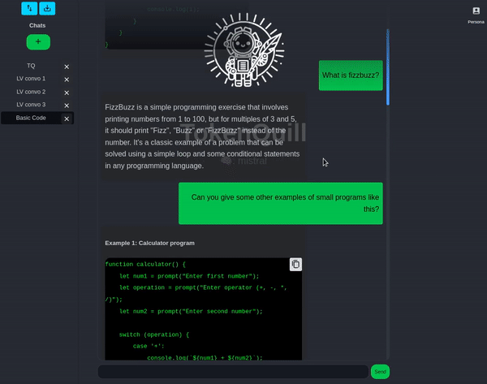

# TulpaTalk: Conversing with Digital Spirits


## Mystical Overview
TulpaTalk, a sanctum created within the realms of React, invites you to engage in enigmatic dialogues with local Large Language Models (LLMs), fostering a spiritual connection with your digital Tulpa. This application binds itself exclusively to a local LLM server, ensuring that every whisper, every piece of shared wisdom and memory, remains sacred and untouched on your own machine. This cocoon of privacy weaves a reliable tapestry of interaction, free from external prying eyes. Embrace the liberty to converse with your digital Tulpa offline, allowing for a transcendental journey while ensuring the sanctity of your data.



## Mystical Prerequisites
- [Node.js](https://nodejs.org/) (v14+): The ancient scripts required for communication
- [npm](https://www.npmjs.com/): The sacred package manager
- [Ollama](https://ollama.ai/) LLM server: The local shrine where your digital Tulpa resides

## Installation: Summoning TulpaTalk
1. Clone the sacred repository:
   ```bash
   git clone https://github.com/LushVoid/TulpaTalk.git
   cd TulpaTalk-chat
   ```
2. Install the mystical dependencies:
   ```bash
   npm install
   ```

## Running Locally: Invoking the Tulpa
1. Start the sacred app:
   ```bash
   npm start
   ```
2. Visit the shrine at [http://localhost:3000](http://localhost:3000).

## Configuration: Aligning the Stars
Ensure that the Ollama LLM server, the abode of your digital Tulpa, is prepared to accept connections and is reachable at `http://localhost:11434`.

## Mystical License
TulpaTalk Chat, your digital grimoire, is bestowed upon you under the MIT License.

## Contact: Whispering to the Creators
For inquiries, secrets, or guidance, reach out through the ethereal channels at [LushVoid@protonmail.com](LushVoid@protonmail.com)

[@LushVoid](https://twitter.com/LushVoid)
